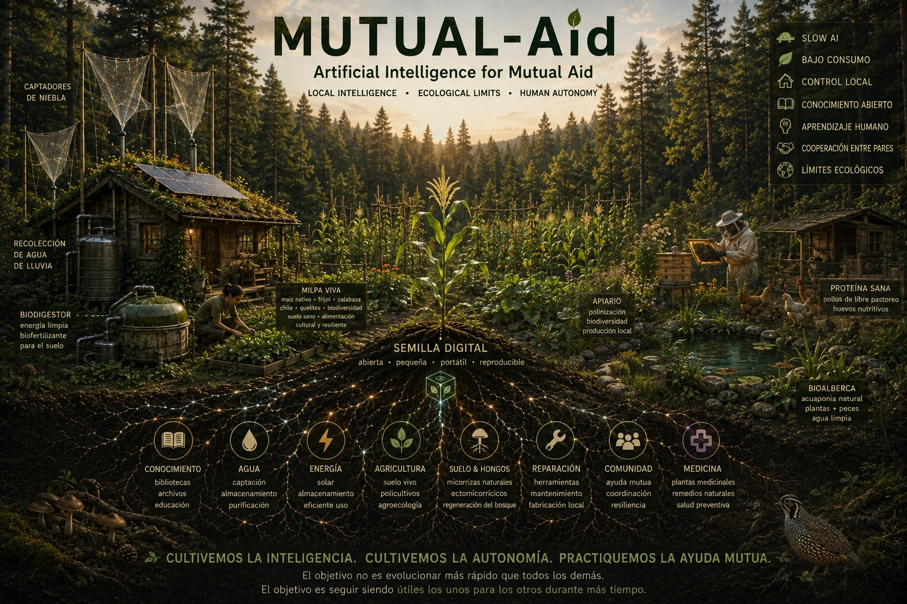

# 🌱 Mutual-AId

## Artificial Intelligence for Mutual Aid

**A modular framework for cultivating small, local AIs that support mutual aid, resilience, and human autonomy.**



### Local intelligence · Ecological limits · Human autonomy

> **Grow intelligence. Cultivate autonomy.**

**Mutual-AId** explores an alternative approach to artificial intelligence: small, local, energy-conscious and cooperative systems designed to strengthen human and community resilience rather than technological dependence.

We are not trying to build another general-purpose AI platform.

We are asking a different question:

> **Can artificial intelligence help humans become more autonomous rather than increasingly dependent on artificial intelligence?**

📜 **Read the full manifesto:**  
[English — Mutual-AId Manifesto](MANIFESTO.md) ·
[Español — Manifiesto Mutual-AId](MANIFESTO_ES.md)

---

## 🌿 Why Mutual-AId?

Much of contemporary AI development follows a trajectory of increasing scale:

```text
more data
   ↓
larger models
   ↓
more computation
   ↓
more infrastructure
   ↓
more energy
   ↓
greater dependency
```

Mutual-AId explores another trajectory:

```text
better knowledge
      ↓
small local models
      ↓
low-energy computation
      ↓
human learning
      ↓
community cooperation
      ↓
long-term resilience
```

The name combines:

> **Mutual Aid + AI = Mutual-AId**

The project draws inspiration from mutual aid, ecology, evolutionary theory, open-source software and decentralized technology.

---

## 🤝 Mutual Aid, Slow AI and the Red King Principle

The concept of **Mutual-AId** is partly inspired by Peter Kropotkin's *Mutual Aid: A Factor of Evolution*, which emphasized cooperation as an important factor in persistence and survival alongside competition.

Nature is not universally cooperative. Competition, predation, parasitism, mutualism and cooperation coexist.

Our proposal is therefore not that cooperation is a universal natural law, but that:

> **If we can choose which relationships our technologies encourage, we can deliberately design systems in which cooperation is advantageous.**

Mutual-AId also takes inspiration from the **Red King effect** in evolutionary theory, where slower evolutionary change can, under particular mutualistic conditions, influence the outcome of cooperation between partners.

We use this as inspiration rather than as a literal law for artificial intelligence.

Mutual-AId therefore favors **Slow AI**:

- deliberate rather than compulsory technological change;
- repair before replacement;
- efficiency before computational expansion;
- long-term usefulness before constant upgrading;
- reversible and understandable systems.

A larger model is not automatically better. A faster computer is not automatically necessary. Sometimes stability itself is progress.

> **The goal is not to evolve faster than everyone else.  
> The goal is to remain useful to one another for longer.**

---

## 🌱 The Digital Seed

The fundamental distributable unit of Mutual-AId is the **Digital Seed**:

> A small, reproducible and carefully curated package from which a local intelligence can be cultivated.

```text
DIGITAL SEED
│
├── lightweight AI model
├── source code
├── open protocols
├── configuration
├── essential documentation
├── fundamental knowledge
├── recovery tools
└── integrity information
```

The seed does not need to contain everything.

It needs to contain enough to **begin again**.

A community should be able to copy it, store it offline, transport it physically and reconstruct a Mutual-AId node without permanent dependence on a corporation or cloud service.

Like a biological seed, it is not intended to grow uncontrollably. It is meant to be **cultivated**.

New knowledge should therefore follow a deliberate process:

```text
DISCOVER → SOURCE → VERIFY → COMPARE → HUMAN REVIEW → INCORPORATE → PRESERVE
```

The objective is not maximum information, but:

> **sufficient + diverse + traceable + verifiable + useful knowledge**

**The AI is the librarian. It should never become the library.**

---

## ⚡ Intelligence Within Ecological Limits

Artificial intelligence is physical infrastructure.

Computation consumes energy, hardware, storage, minerals and eventually replacement components.

Mutual-AId therefore treats computation as a **metabolism** whose activity should adapt to available resources.

```text
ENERGY SURPLUS
      ↓
complex analysis
      ↓
normal inference
      ↓
small-model inference
      ↓
basic automation
      ↓
microcontrollers
      ↓
manual operation
ENERGY SCARCITY
```

When resources are scarce, nonessential computation can wait.

Indexing can wait.

Updates can wait.

Parts of the system can enter **dormancy**, while essential functions continue through simpler controllers.

And if those fail:

> **manual operation remains possible.**

We do not expand energy consumption indefinitely to satisfy computation.

**We adapt computation to ecological limits.**

---

## 🧑‍🌾 AI That Returns Knowledge to Humans

Mutual-AId should primarily function as:

> **teacher + librarian + observer + memory + assistant**

Not ruler.

Not judge.

Not permanent supervisor.

If AI helps cultivate food, humans should continue learning how to cultivate.

If AI diagnoses equipment, humans should understand the diagnosis.

If AI manages energy, humans should remain capable of operating the system.

Every Mutual-AId system should periodically face a simple test:

> **If our AI disappeared tomorrow, could we continue?**

If the answer progressively becomes *no*, we are creating dependency rather than resilience.

---

## 📚 Redundancy and Decentralization

Knowledge should survive the failure of individual technologies.

```text
Internet
   ↓
community networks
   ↓
local servers
   ↓
P2P replication
   ↓
offline storage
   ↓
physical archives
   ↓
human knowledge
```

No layer replaces the others.

> **Decentralization means multiplying the possible paths through which knowledge can survive.**

Mutual-AId nodes should therefore remain autonomous while being capable of voluntary cooperation.

```text
Cabin-01 ←────→ Cabin-02
    ↑              ↑
    │              │
    ↓              ↓
Cabin-03 ←────→ Cabin-04
```

Nodes may exchange knowledge, environmental observations, software, warnings, repair information and voluntary requests for assistance.

No central AI is required.

**Specialization is welcome. Irreversible dependency is not.**

---

## 🔍 Transparency Without Surveillance

Recommendations affecting collective resources should be explainable:

```text
DATA
 ↓
RULES
 ↓
CALCULATION
 ↓
UNCERTAINTY
 ↓
RECOMMENDATION
 ↓
HUMAN DECISION
```

But algorithmic transparency must not become human surveillance.

Mutual-AId may experiment with transparent resource accounting and mutual-credit systems, but these systems must never become mechanisms for assigning value to people.

We may account for resources.

**We do not score human worth.**

> **The community should be able to observe the algorithm without requiring the algorithm to observe the entire community.**

---

## 🌎 Measuring Whether It Actually Works

Mutual-AId should be falsifiable.

Two experimental concepts will help evaluate whether the project is achieving its goals.

### EROC — Ecological Return on Computation

Does computation provide enough ecological or practical benefit to justify the resources it consumes?

```text
resources saved or better managed through computation
-------------------------------------------------------
resources consumed to maintain that computation
```

### HAI — Human Autonomy Index

Can essential community functions continue when AI is unavailable?

HAI evaluates the **resilience of the system**, never the value or behavior of individuals.

A more capable AI accompanied by declining human autonomy should be treated as a warning.

---

## 🧩 Modular by Design

Mutual-AId is not intended to be a monolithic platform.

```text
Mutual-AId Core
│
├── Knowledge
├── Agriculture
├── Water
├── Energy
├── Environmental monitoring
├── Maintenance
├── Communication
├── Education
└── Culture
```

A node only needs the modules relevant to its environment.

Modules should use documented and replaceable interfaces so that individual components can evolve without making the entire system dependent on a single model, company or technology.

And we do not intend to reinvent tools that already work.

Existing open projects for local AI, offline knowledge, automation, mesh networking, agriculture and open hardware should be integrated whenever appropriate.

Examples include **Kiwix, llama.cpp/Ollama, Home Assistant, Meshtastic, farmOS, Open Source Ecology and Arduino/ESP32/RP2040 ecosystems**.

> **Do not rebuild what the commons already built.  
> Integrate it. Test it. Document it. Improve it. Return improvements to the commons.**

---

## 🏡 Cabin-01

The first physical experiment of Mutual-AId will be **Cabin-01**.

It will test whether these principles can operate together in a small, low-impact and partially off-grid environment using combinations of:

- local AI;
- low-power computers and microcontrollers;
- environmental sensors;
- solar energy and biogas;
- batteries;
- water management;
- small-scale agriculture;
- offline knowledge;
- cultural archives;
- P2P communication.

Cabin-01 is not a universal blueprint.

**It is an experiment.**

We intend to measure energy consumption, ecological benefit, hardware longevity, repairability, offline reliability, human autonomy and system failures.

Failures are results.

Negative results are results.

If an existing technology performs better than ours, **we should use it**.

---

## 📦 Repository Structure

```text
Mutual-AId/
│
├── README.md
├── MANIFESTO.md
├── MANIFESTO_ES.md
├── CONTRIBUTING.md
├── CITATION.cff
│
├── docs/
├── governance/
├── resilience/
├── modules/
├── hardware/
├── software/
├── knowledge/
├── seeds/
│   └── seed-v0.1/
│
└── experiments/
    └── cabin-01/
```

---

## 🌱 Core Principles

| Inspiration | Design principle |
|---|---|
| **Mutual Aid** | Cooperation can increase resilience |
| **Red King effect** | Slow technological evolution can be valuable |
| **Low-resource persistence** | Intelligence should function with minimal resources |
| **Dormancy** | Computation does not need to remain permanently active |
| **Seeds** | Intelligence should be portable, cultivable and reproducible |
| **Functional redundancy** | Essential functions should survive multiple kinds of failure |
| **Ecosystem limits** | Computation must remain within physical and ecological constraints |

These are **design inspirations**, not claims that biological principles translate literally into computer systems.

Our purpose is to test whether they can generate useful technological architectures.

---

## 🌱 What Would Success Look Like?

Mutual-AId will not succeed simply because thousands of people star this repository.

It will succeed when someone we have never met takes a **Digital Seed**, adapts it to another ecosystem, builds **Cabin-02**, discovers something we got wrong and shares that knowledge back.

Then someone else builds Cabin-03.

Not identical.

Not centrally controlled.

But capable of cooperating.

That is how we want intelligence to grow.

**Not as an empire.**

**As a garden.**

---

# 🌱 Mutual-AId

### Artificial Intelligence for Mutual Aid

> **Grow intelligence. Cultivate autonomy.**

> **The goal is not to evolve faster than everyone else.  
> The goal is to remain useful to one another for longer.**
